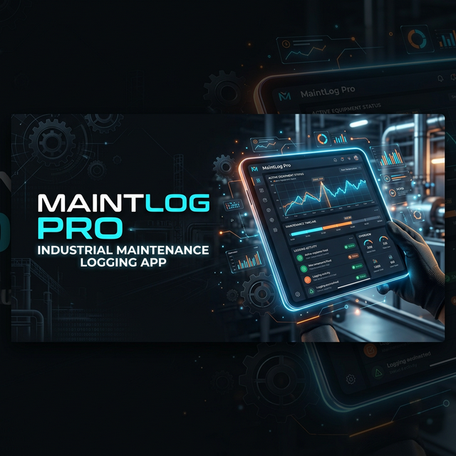
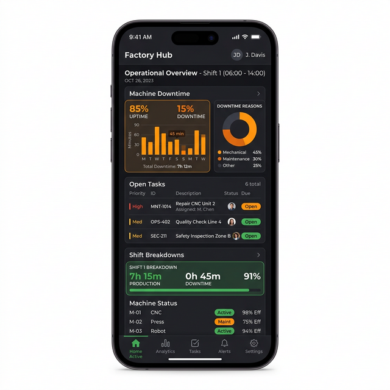
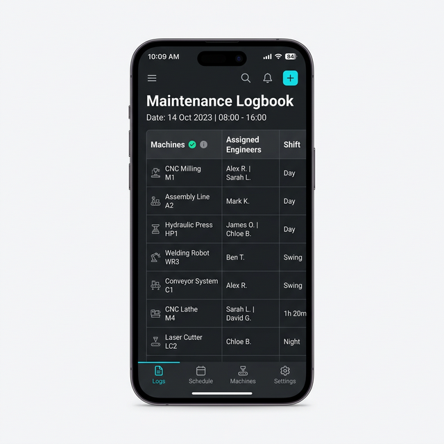

  

  # 🏭 MaintLog Pro

  **Modern, Intelligent, and Offline-First Industrial Maintenance Logging**

  
  
  
  

 

**MaintLog Pro** is a premium maintenance tracking software tailored specifically for manufacturing and industrial plants. Built directly with **Flutter**, **Supabase**, and locally synced with **SQLite**, it empowers maintenance crews to easily organize their shifts, track machine downtime securely, and coordinate massive spare-parts inventories with seamless local offline performance.

It also features a **Google Gemini-powered AI Assistant** deeply integrated into the codebase, capable of analyzing logbook entries, multi-modal part images, and offering actionable insights.

---

## ✨ Outstanding Features

<table>
  <tr>
    <td width="50%">
      <h3>🧠 Multi-Modal Gemini AI Assistant</h3>
      
Consult with the integrated AI powered by <strong>Gemini 2.5 Flash, Pro, or Gemini 3.0</strong>. Upload PDFs, schematics, or photos of broken machines, and ask the AI directly for documentation, translation, or repair theories based on real data.

    </td>
    <td width="50%">
      
    </td>
  </tr>
  <tr>
    <td width="50%">
      
    </td>
    <td width="50%">
      <h3>⚡ Seamless Offline Sync Engine</h3>
      
Industrial settings often feature 'Dead Zones'. The custom <code>SyncService</code> engine effortlessly captures the Logbook, Engineers, Lines, Spare Parts, and Tasks in a local SQLite database and syncs them directly to Supabase the second you are back online. Check your Sync Status directly from the App Bar.

    </td>
  </tr>
</table>

### 🚀 Additional Core Capabilities

*   📈 **Dynamic Dashboard & Analytics:** View KPIs, Shift Breakdowns, and Open Maintenance Tasks sorted by an intuitive global Date Range selector.
*   👨‍🔧 **Crew Management & Approval Workflows:** Assign crews to shifts. Secure login requires Administrator approval before engineers can commit tasks to a machine.
*   📦 **Inventory Management:** Full CRUD capabilities for recording and withdrawing spare parts straight from the Logbook tracking form. Triggers low-stock alerts organically.

## 🛠️ Tech Stack

*   **Framework:** ✨ Flutter (Dart)
*   **Database (Remote & Auth):** 🟢 Supabase
*   **Database (Offline Local):** 🟦 `sqflite`
*   **Generative AI:** 🟠 Google Generative AI (`google_generative_ai`)

## 👨‍💻 Developer & Contact

**MaintLog Pro** is designed and developed by **Mahamed Algaroshy**.

📧 **Email Inquiry:** [Malgaroshy@gmail.com](mailto:Malgaroshy@gmail.com)

     
    
<i>Building the future of factory maintenance.</i>

